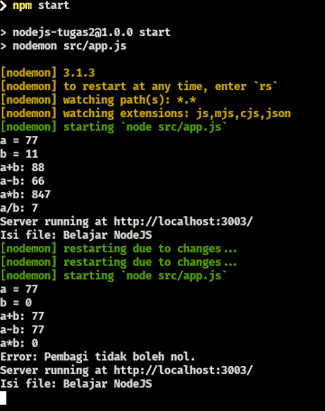

# Tugas 2 Sanbercode Node.JS Backend

## Muhammad Ridwan Hakim

### Deploy Localhost

```bash
git clone https://github.com/rescenic/nodejs-tugas2-maths-httpserver-fs.git

npm install

npm start

```

### Screenshots


